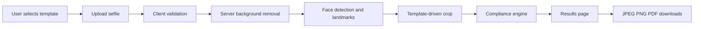

# PassportAI Architecture

## Architecture Overview

PassportAI is a stateless Next.js 15 application with a browser-first user experience and server-side API protection for sensitive integrations. The application uses JSON-driven document templates, client-side computer vision where practical, server-side background removal through Remove.bg, and local browser storage for MVP state.

## High-Level Flow



## Core Modules

### Template Registry

Loads document requirements from JSON files. The registry exposes lookup functions by template id, country, and document type.

Responsibilities:

- Validate template schema.
- Provide defaults for optional thresholds.
- Keep crop and compliance engines independent from country-specific code.

### Processing Pipeline

Coordinates upload validation, background removal, landmark detection, cropping, compliance checks, and export generation.

Recommended pipeline stages:

1. validateInput
2. loadTemplate
3. removeBackground
4. detectFaces
5. detectLandmarks
6. cropToTemplate
7. runCompliance
8. generateExports

### Background Removal Service

Server-only adapter around Remove.bg API.

Responsibilities:

- Hide API key.
- Normalize errors.
- Return processed image buffer or URL-safe payload.
- Support future provider fallback.

### Vision Service

Uses MediaPipe and OpenCV utilities for face and image analysis.

Responsibilities:

- Detect face count.
- Estimate eye visibility.
- Estimate head bounds.
- Estimate yaw/pitch/roll for looking-straight check.
- Measure brightness and sharpness.
- Provide normalized metrics for compliance.

### Crop Engine

Uses the selected template and face metrics to create a passport-ready crop.

Responsibilities:

- Convert mm to pixels using DPI.
- Calculate output canvas.
- Position face center.
- Enforce head ratio range.
- Fill required background.
- Return final image canvas/blob.

### Compliance Engine

Runs 10 fixed MVP checks using template thresholds and measured vision metrics.

Responsibilities:

- Produce score.
- Produce pass/warning/fail result.
- Produce suggestions.
- Keep check outputs explainable.

### Export Service

Generates downloadable formats.

Responsibilities:

- JPEG export.
- PNG export.
- PDF export with physical dimensions.
- Filename generation.

## Proposed Folder Structure

```text
passportai/
  app/
    page.tsx
    upload/
      page.tsx
    results/
      page.tsx
    api/
      remove-background/
        route.ts
      process/
        route.ts
      export/
        pdf/
          route.ts
  components/
    landing/
      Hero.tsx
      Features.tsx
      HowItWorks.tsx
    upload/
      CountrySelector.tsx
      UploadDropzone.tsx
      ProcessingTimeline.tsx
    results/
      BeforeAfterComparison.tsx
      ComplianceReport.tsx
      DownloadPanel.tsx
      TemplateSummary.tsx
    shared/
      AppShell.tsx
      StatusBadge.tsx
      ProgressStep.tsx
  data/
    passport-templates.json
  lib/
    templates/
      registry.ts
      schema.ts
    vision/
      faceDetection.ts
      faceMesh.ts
      imageMetrics.ts
      opencv.ts
    processing/
      pipeline.ts
      backgroundRemoval.ts
      cropEngine.ts
      complianceEngine.ts
      exportService.ts
    storage/
      localSession.ts
    utils/
      dimensions.ts
      errors.ts
      files.ts
  public/
    samples/
  styles/
    globals.css
  docs/
  Dockerfile
  docker-compose.yml
  next.config.ts
  package.json
```

## Route Structure

```text
/                 Landing page, features, how it works
/upload           Country selector, upload, processing flow
/results          Before/after, compliance report, downloads
/api/remove-background
/api/process
/api/export/pdf
```

## API Structure

```text
POST /api/remove-background
  Input: multipart image
  Output: background-removed image payload

POST /api/process
  Input: image payload, templateId
  Output: processed image, metrics, compliance report

POST /api/export/pdf
  Input: final image, templateId
  Output: PDF file
```

For V1, processing may be split between client and server. The API design should still make it possible to move heavier processing server-side later.

## Data Model

### Document Template

```json
{
  "id": "india_passport",
  "country": "India",
  "document": "Passport",
  "width_mm": 35,
  "height_mm": 45,
  "background": "white",
  "dpi": 300,
  "head_ratio_min": 70,
  "head_ratio_max": 80,
  "face_center_tolerance": 0.08,
  "min_width_px": 413,
  "min_height_px": 531
}
```

### Compliance Result

```json
{
  "score": 92,
  "status": "pass",
  "checks": [
    {
      "id": "face_centered",
      "label": "Face centered",
      "status": "pass",
      "points": 10,
      "suggestion": null
    }
  ],
  "suggestions": ["Move slightly closer to the camera"]
}
```

## State Strategy

V1 uses local browser state only:

- selectedTemplateId
- uploaded image preview
- processed result
- compliance report

Use local storage only for non-sensitive flow recovery. Avoid long-term image persistence.

## Deployment Architecture

Vercel hosts the Next.js app and API routes. Remove.bg is accessed from server routes only. Static template JSON is bundled with the app. No database or object storage is required for V1.

Future scale path:

- Add object storage for temporary files.
- Add queue for async processing.
- Move OpenCV-heavy work to dedicated worker.
- Add observability and rate limiting.

