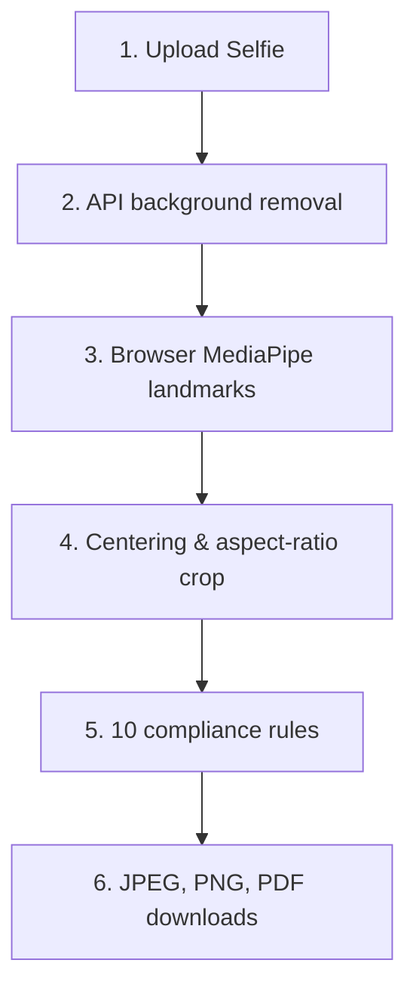

# PassportAI Architecture

PassportAI is a stateless, browser-first Next.js 15 application. It combines server-side API endpoints for sensitive integrations (such as background removal) with client-side computer vision models to provide a zero-storage, privacy-by-design user experience.

---

## High-Level Processing Pipeline

The pipeline operates in six distinct stages:
1.  **Selection & Upload**: The user selects a target template (e.g., India Passport) and uploads a JPEG or PNG image under 10MB.
2.  **Background Removal**: The client sends the image to the server (`/api/remove-background`), which forwards it to the Remove.bg API, normalizes the transparent output, flattens it with the template's required background color using the Sharp library, and returns a Base64 PNG.
3.  **Landmark Extraction**: The client loads MediaPipe Face Mesh client-side to detect face landmarks (chin, nose tip, left/right eyes, hairline) in the processed image.
4.  **Crop Derivation**: The crop engine calculates ideal crop boundaries based on the detected landmarks and output aspect ratios.
5.  **Compliance Audit**: Ten compliance rules check face bounds, headroom margins, rotation, exposure, and focus.
6.  **Multi-Format Export**: The final crop is drawn onto HTML5 canvas with brightness/contrast filters and exported as JPEG, PNG, or a print-ready PDF using `pdf-lib`.

---

## Core System Modules

### 1. Template Registry & Schema
Loads and serves specifications from a static JSON file (`data/passport-templates.json`). The registry supports lookup functions used by the selector and validation systems.
*   **Dimensions**: Width and height in millimeters (e.g., 35 x 45 mm).
*   **DPI**: Output resolution density (default: 300 DPI) to convert millimeters to exact target pixels.
*   **Background**: Expected background color (e.g., solid white, light gray).
*   **Ratios**: Mandated head height ranges (e.g., head must occupy 50% to 80% of the frame).

### 2. Client-Side Vision Service
Runs the **MediaPipe Face Mesh** model directly in the browser to offload server costs and ensure absolute user privacy.
*   Extracts 468 3D facial coordinate landmarks.
*   Estimates face orientation (yaw, pitch, roll) from relative distances of eyes, nose, and chin.
*   Measures image focus/sharpness via edge gradients and exposure/brightness via pixel color sampling.

### 3. Crop Engine
Calculates the cropping boundaries `{ x, y, width, height }` based on facial landmarks and target template constraints.
*   **Aspect Ratio Preservation**: Computes width from the output aspect ratio: `cropWidth = cropHeight * aspect`.
*   **Unclamped Centering**: Position coordinates are centered directly around the face midline:
    *   `cropX = faceCenterX - cropWidth / 2`
    *   `cropY = idealTop`
*   **Out-of-Bounds Padding**: The crop engine permits coordinates to go outside the source image bounds (negative `x`/`y` or extending beyond image dimensions). This ensures the face is never shifted off-center and the aspect ratio is never distorted.

### 4. Canvas Drawing Helper
The `drawCroppedImage` function handles rendering of the crop coordinates onto the final output canvas.
*   **White Padding**: Clears the canvas with a solid white background. If the crop box is out of bounds, the empty space is rendered as a clean white border.
*   **Studio Lighting Filter**: Applies a canvas filter `brightness(1.06) contrast(1.04) saturate(1.02)` during rendering to automatically boost exposure and enhance output aesthetics.

### 5. Compliance Engine
Validates the cropped photo against ten checks, deducting points from a base score of 100:
*   *Critical Errors* (e.g., multiple faces, bad head ratio, no headroom, off-center alignment) deduct 20 points and fail compliance.
*   *Warnings* (e.g., exposure warnings, blur warnings) deduct 5 points and provide feedback without failing compliance.

### 6. Export Engine
Transforms the canvas buffer into final download files.
*   **JPEG**: Exported at 95% quality for small file size.
*   **PNG**: Exported as lossless image.
*   **PDF**: Generates a standard document embedding the PNG crop, scaling it to matching physical dimensions.

---

## State & Privacy Strategy

To meet strict privacy standards:
*   No images are stored on the server or database.
*   Uploaded and processed file streams are temporarily kept in client-side memory (`sessionStorage`) and discarded immediately when the user navigates away or closes the browser tab.
